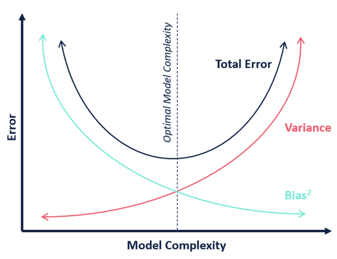
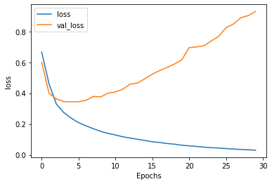

## distributed_hyperparameter_search

This project is aimed at searching the hyperparameter space and come up with the most optimal set of hyperparameters 
that will give the best balance between the training and test metrics.

The attempt will be to get this working through and through, for a toy problem like MNIST or MNIST Fashion, using a CNN,
and later extend other types of networks like RNN, GAN, network extensions through transfer learning etc.

## Choosing the model
The search should aim to balance and settle for the sweetspot between bias and variance

## Stop the training if a drift is detected between training and test loss
If it is detected that there is a drift between the training and test loss, it is recorded and the training is stopped.

Finds out if there is a drift and stops the training

## Interface 
